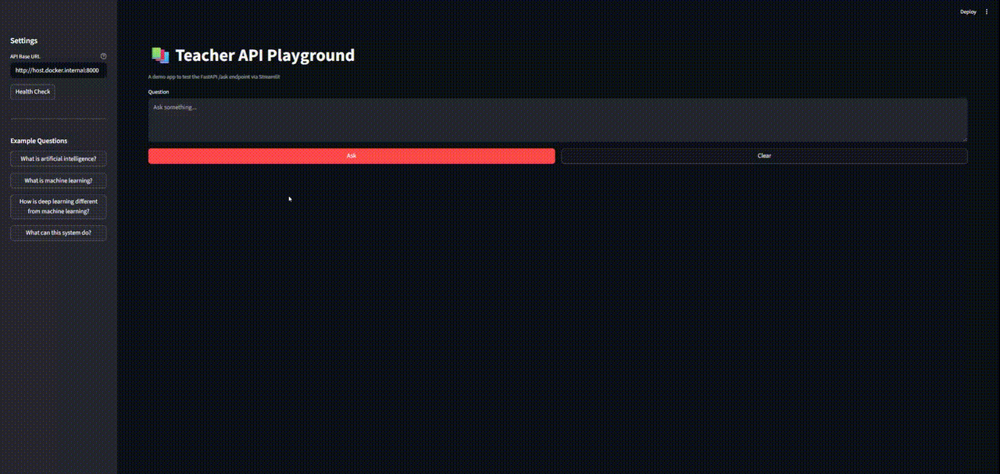

# teacher

`teacher` is a portfolio project that demonstrates a full Retrieval-Augmented Generation (RAG) application with:

- a FastAPI backend
- a PostgreSQL vector store
- an OpenAI-powered answer generation flow
- a Streamlit frontend for testing the `/ask` endpoint

---
## Demo



---

## Project Structure

frontend/   Streamlit UI  
backend/    FastAPI API, ingestion pipeline, database schema, and RAG logic  

---

## Features

- Wikipedia-based dataset generation
- Retrieval-Augmented Generation (RAG)
- Vector search with PostgreSQL
- FastAPI-based API
- Streamlit demo frontend
- Docker-based local development

---

## Quick Start

### Backend

```
cd backend  
make build  
make up  
```

Swagger UI:  
http://localhost:8000/docs  

---

### Frontend


```
cd frontend  
make build  
make up  
```

Streamlit UI:  
http://localhost:8501  

---

## Demo Flow

1. Ingest documents into the vector database  
2. Open the Streamlit frontend  
3. Send a question to the `/ask` endpoint  
4. Review the generated answer and sources  

---

## Documentation

- See backend/README.md for backend details  
- See frontend/README.md for frontend details  
